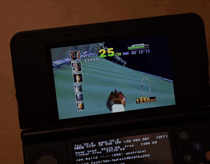
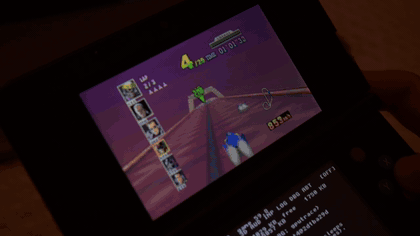
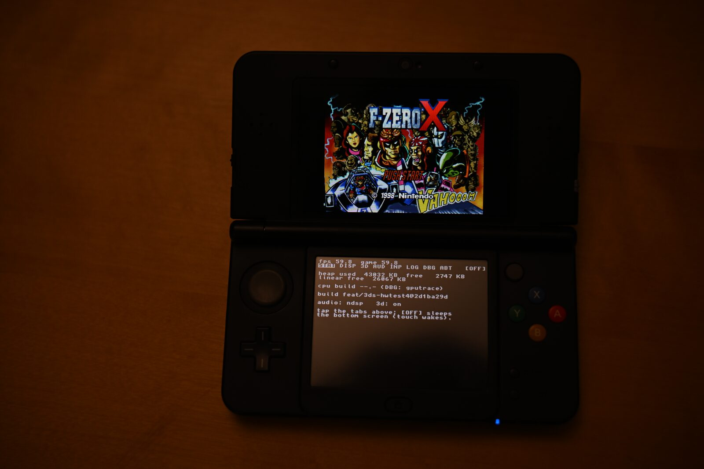
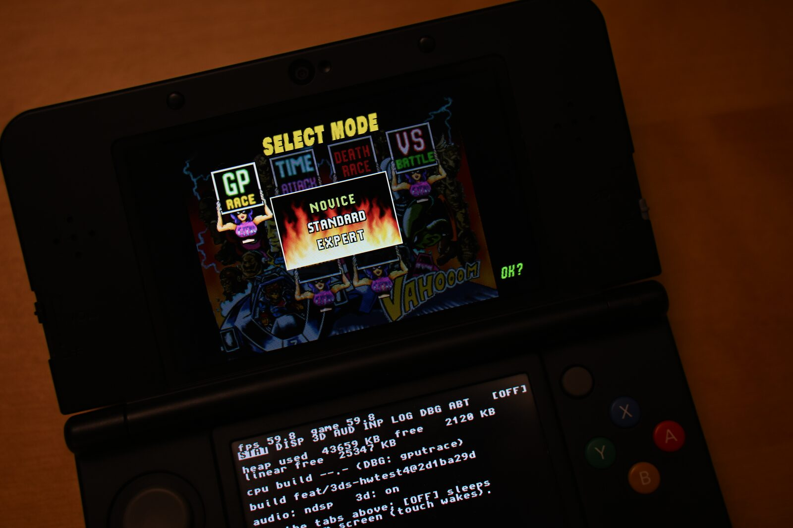
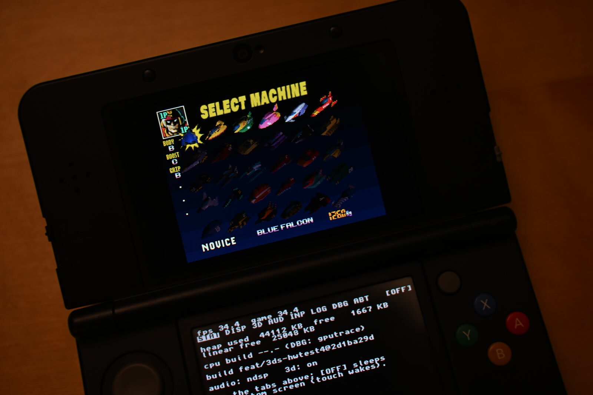
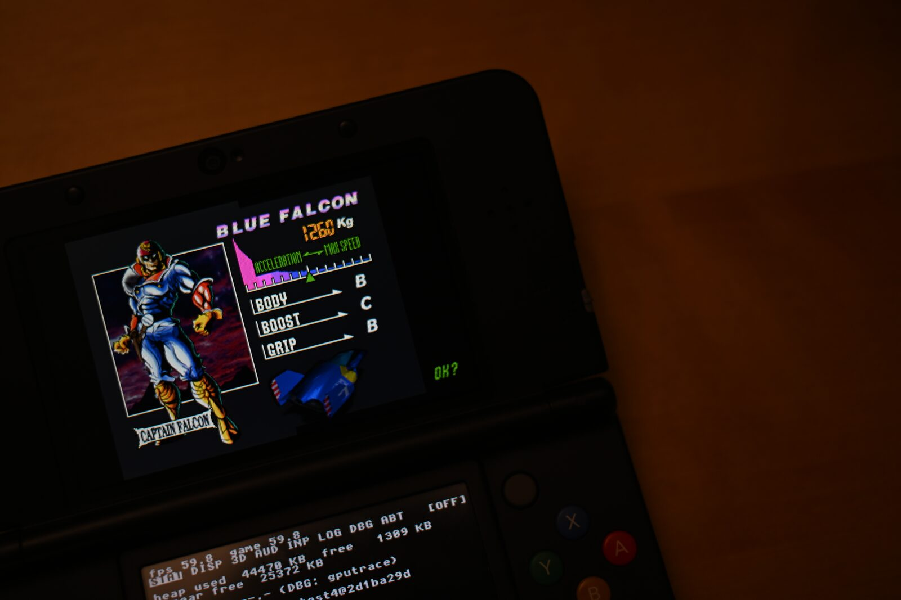

# G-Diffuser 3DS — F-Zero X on the Nintendo 3DS

A homebrew port of the **F-Zero X decompilation** to the New Nintendo 3DS / New 2DS,
built on the G-Diffuser PC port. Runs natively on console hardware with stereoscopic
3D, full audio, and a touch-screen settings menu.

> **This is a fan-made, educational software-preservation project.**
> See the [Legal](#legal) section before downloading or building anything.

## On hardware

  
  

<table>
  <tr>
    <td></td>
    <td></td>
  </tr>
  <tr>
    <td></td>
    <td></td>
  </tr>
</table>

Full-quality clips: [Grand Prix](https://cruxxxxxx.github.io/gdx-3ds/media/gameplay-race.mp4) ·
[handheld](https://cruxxxxxx.github.io/gdx-3ds/media/gameplay-handheld.mp4). The bottom screen in every shot is the
port's own debug menu (STAT tab): frame rate, heap, build id.

## Author's notes

Hello reader. This is the only section of this project written by a real human. Isn't that kind of neat? Well, I guess it depends on how you feel about all of these changes in our lives. In this section, I'll quickly detail my thoughts on this 100% AI generated port, its reflection on the direction of software development, and my own experience in using Claude Code to create it.

---

Awhile back I saw [Chris Lewis make a post about using Claude](https://blog.chrislewis.au/using-coding-agents-to-decompile-nintendo-64-games/) to assist in the Snowboard Kids 2 decompilation. It got me thinking: what a perfect use-case for a coding agent. It's a long running, tedious, endeavor of classification and definition.

I realized that one day I'd like to port F-Zero X to 3DS using a coding agent when it was decompiled/ported. So when [G-Diffuser](https://github.com/Zorkats/G-Diffuser) port was released based on the [Inspectredc Decompilation](https://github.com/inspectredc/fzerox), I gave it a shot. I pulled a bunch of adjacent repositories & documentation together, fed it to Claude using deep research, read the master plan and gave it the OK to spin up a bunch of subagents. For 3 weeks, I babysat and assumed a role somewhere between a Product Owner and a QA tester.

1. Claude suggests an implementation strategy to either fix a bug or improve performance.
2. I approve the suggestion, push back, or do research/implore research if we seem to hit a dead end.
3. Claude works and validates in Azahar emulator.
4. Claude provides a build and I test on 3DS.
5. I report back and provide debug logs. Loop continues.

This continued until it was 'done'. It still totally blows my mind that after 24 days I can play F-Zero X in 3D at a near solid 60fps.

---

Since my first experience using ChatGPT in 2022, I was filled with total existential dread. I saw my livelihood threatened, as this skill I had dedicated my life to became immediately devalued. Since then, I've used LLM chatbots & coding tools extensively and I've oscillated between feelings of fascination, fear, humility, intrigue, reward, and emptiness.

This project revealed to me how much things have changed. The complexity of this project cannot be overstated: this is a marvel. This is nothing short of a miracle. And it was done by a machine, with no human intervention on the code. I never read a line. I never made a true technical decision.

I learned how to program 15 years ago with the dream of contributing projects like this, and since then I've come to a stark realization: while I COULD plausibly port F-Zero X to the 3DS by hand, the time in my life IS finite, and when weighed against other life pursuits such as making an original game, it would not serve me well. I'm sure the journey would make me a better programmer. I'm sure I would learn so much about graphics rendering, address-space heuristics, the 3DS architecture, edge device profiling, etc. And I wholeheartedly thank & admire everyone whose work this is built off of, many of you are nameless but overwhelmingly appreciated.

The (terrifying) fact is: this would've taken me a few thousand hours of my life. For professionals, this might've cost nearly 80x to make (actually, even more, because Claude is currently subsidized).

So to any naysayers, feel free to not play. I understand. The ethics of LLMs are muddy and their incoming impact on society is understated. This project, in my opinion, serves as proof of the latter. However, to anyone who has ever dreamed of F-Zero X 3DS, enjoy.

## Post-mortem

The full story of the port — every step from research to a native-60 stereoscopic build in 24 days, the road to 60 fps round by round, what fought back, what is new, how the agent fleet was run, and what it cost — is published as a small site:

**https://cruxxxxxx.github.io/gdx-3ds/** (source under `docs/postmortem/`, also available as a PDF there).

## Repository layout

| Path | What |
|---|---|
| `port/3ds/` | The 3DS port: citro3d renderer, stereo, ndsp audio, input, touch menu, lifecycle, render thread, profilers, packaging |
| `port/3ds/patches/` | Pure-delta patch stack applied over the untouched `decomp/` and `libultraship/` submodules (apply order in its README) |
| `port/` | The G-Diffuser PC port this builds on (see `README-G-Diffuser.md`) |
| `tools/prebake/` | Converts *your* ROM into the archives the console reads; `tools/ci-3ds.sh` applies the patches and builds |
| `docs/3DS-HARDWARE.md` | Toolchain, SD layout, install, troubleshooting |
| `docs/research/` | Working notes, briefs, measurements and verdicts written during development |
| `docs/postmortem/` | The post-mortem site and its generator |

---

## Features

- **Native play on New 3DS / New 2DS** — ~50–60 fps typical, with an in-game
  RIVAL DETAIL performance option for heavy 30-machine packs
- **Stereoscopic 3D** — real depth via the 3D slider, with adjustable strength and
  convergence from the touch menu
- **Full audio** — music and sound effects through the 3DS DSP
- **Bottom-screen touch menu** — display modes (including a full-screen borderless
  mode), 3D tuning, volume, controller remapping, a log viewer, debug toggles, and
  a screen-off battery saver
- **Proper system integration** — HOME menu, sleep mode, and clean power-off
- **Multi-core rendering** — the display-list renderer runs on the New 3DS's spare core
  (DBG tab "RENDER THR"; relaunch to change)
- **Two install formats** — Homebrew Launcher `.3dsx` or an installable `.cia`

## Requirements

| What | Why |
|---|---|
| New Nintendo 3DS / New 2DS | The port targets the New3DS CPU (804 MHz + L2). Old 3DS is unsupported. |
| [Luma3DS](https://3ds.hacks.guide) custom firmware | Homebrew execution (and sigpatches for the `.cia` route) |
| **Your own F-Zero X (USA) ROM** | **No game data is included or downloadable — you must dump the cartridge you own.** Assets are converted on your PC (see below); the ROM itself never goes on the console. |
| `dspfirm.cdc` DSP firmware dump | Required for audio; dump it on your own console with the DSP1 homebrew app |

## Building & installing

1. **Build the port** (or use a release artifact if one is published): devkitPro +
   CMake; see `docs/3DS-HARDWARE.md` for the full toolchain walkthrough.
2. **Convert your game assets on your PC**: `tools/prebake` takes *your* F-Zero X
   (USA, rev 0) ROM dump and produces `fzerox.o2r` / `gdiffuser.o2r` archives (the audio
   table is stored uncompressed so boot audio starts cleanly; see `tools/prebake/README`).
   This step runs entirely on your computer, with your legally dumped ROM.
3. **Copy to SD**: the archives go in `sdmc:/3ds/gdiffuser/`, the `.3dsx` in
   `sdmc:/3ds/` (or install the `.cia` with FBI).
4. Launch from the Homebrew Launcher or HOME menu. Full details, SD layout, and
   troubleshooting: **`docs/3DS-HARDWARE.md`**.

## Controls

| 3DS | Action |
|---|---|
| Circle Pad | Steer |
| A | Accelerate |
| B / Y / ZL / ZR | Boost |
| L / R | Slide-drift left / right |
| C-stick ↓ | Brake |
| C-stick | Camera |
| START | Pause |
| Touch screen | Settings menu |

All bindings are remappable from the touch menu (INPUT tab).

## Legal

- **Not affiliated with, endorsed by, or sponsored by Nintendo.** Nintendo, F-Zero,
  Nintendo 3DS, and Nintendo 64 are trademarks of Nintendo Co., Ltd. All original
  game content is © Nintendo.
- **This project contains no game assets, no ROM, and no copyrighted Nintendo
  material**, and none is available from this project in any form. It is a port of
  independently produced, matching decompiled source code. To play, you must supply
  a ROM image dumped from a cartridge you legally own, and the asset conversion
  happens on your own computer.
- **Educational purpose**: this project exists for the study of software
  preservation, compiler/runtime engineering, and console homebrew development.
  It is non-commercial and must never be sold, bundled with game data, or
  distributed with pre-converted assets.
- If you enjoy F-Zero, support the rights holder — buy official releases.

## Credits

- **[inspectredc's F-Zero X decompilation](https://github.com/inspectredc/fzerox)** —
  the matching decomp this port is built on, and the work of every decomp contributor
- **[G-Diffuser](https://github.com/Zorkats/G-Diffuser)** — the PC port foundation (libultraship-based runtime)
- **[libultraship](https://github.com/Kenix3/libultraship)** (Kenix3 & contributors) —
  the N64 runtime/renderer framework
- **[devkitPro](https://devkitpro.org)** — toolchain; **citro3d** (fincs) — PICA200
  GPU library; **libctru** (smea & contributors)
- **[Azahar](https://azahar-emu.org)** — 3DS emulator used during development
- The sm64-port / Ship of Harkinian communities, whose public engineering informed
  many techniques in this port

## Known issues

- Heavy 30-machine packs can dip below 60 fps (use RIVAL DETAIL: REDUCED/MINIMAL)
- A rarely visible tunnel-roof rendering quirk on one course
- Debug toggles (GPUTRACE, VERBOSE) cost frame time and audio smoothness; leave them off to play

Bug reports: include `sdmc:/3ds/gdiffuser/log.txt` (enable `filelog` in the DBG menu).
